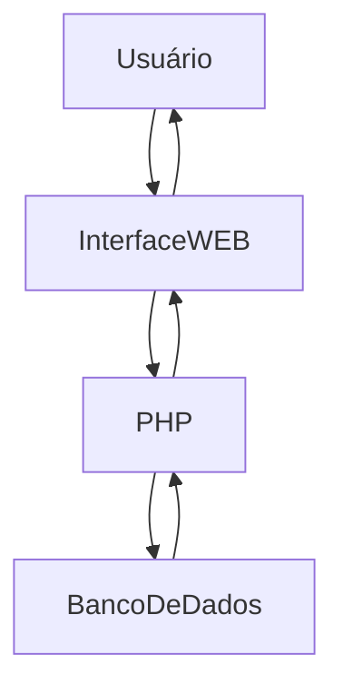
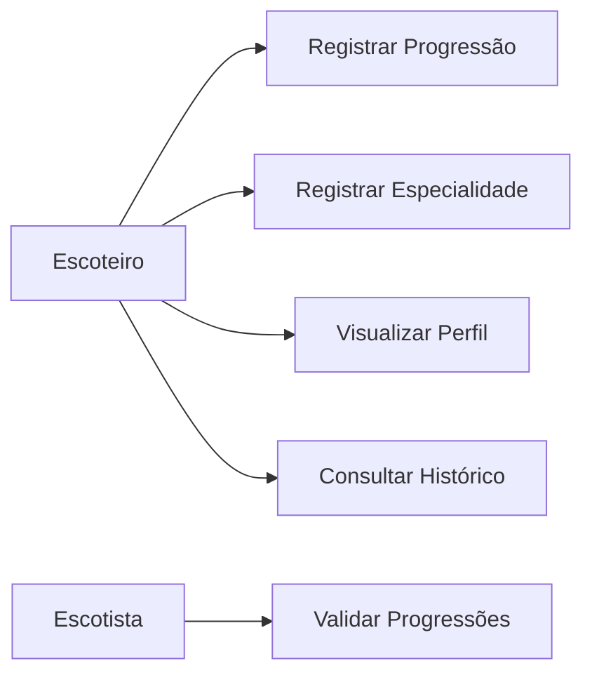
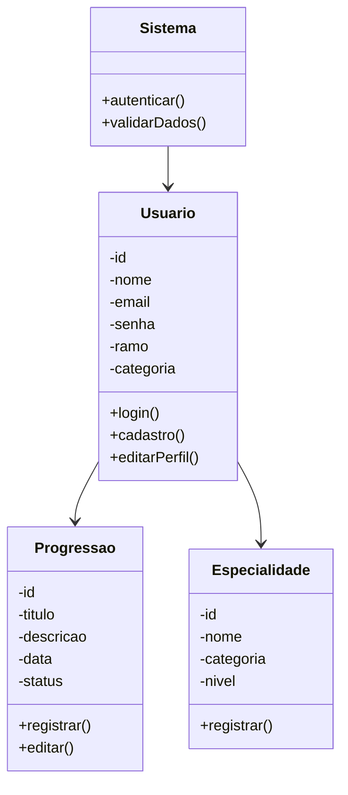

# Sistema de Gerenciamento da Vida Escoteira e Progressão Pessoal

# Documentação de Especificações de Requisitos de Software (SRS)

## Azimute

**Versão:** 1.0.0
**Data:** 2026-05-28
**Autor:** LorenzoPradalMalosso

---

# 1. Introdução

## 1.1 Propósito

Este documento descreve os requisitos do sistema **Azimute**, com objetivo de:

* Definir funcionalidades da aplicação
* Padronizar o entendimento de stakeholders
* Servir como base para desenvolvimento e testes

---

## 1.2 Escopo

O sistema permitirá:

* Fazer cadastro e login de escoteiros (todos os ramos)
* Gerenciar progressões pessoais
* Registrar especialidades e conquistas
* Registrar datas importantes da vida escoteira
* Visualizar histórico de evolução
* Exibir perfil do usuário

O sistema será uma aplicação WEB desenvolvida com:

* **PHP** – processamento do servidor e regras do sistema
* **HTML** – estrutura das páginas
* **CSS** – estilização e layout
* **JavaScript** – interações e dinamismo
* **PostgreSQL** – armazenamento de dados

---

## 1.3 Definições

| Termo         | Definição                                          |
| ------------- | -------------------------------------------------- |
| Progressão    | Conjunto de etapas de evolução do escoteiro        |
| Especialidade | Conhecimento ou habilidade desenvolvida pelo jovem |
| Conquista     | Objetivo alcançado pelo usuário                    |
| Ramo          | Categoria etária do movimento escoteiro            |

---

# 2. Descrição Geral do Sistema

## 2.1 Perspectiva do Sistema

O sistema será uma aplicação web integrada a banco de dados e acessada via navegador.

---

## 2.2 Funções do Sistema

O sistema deve:

* Permitir cadastro e login
* Registrar progressões
* Registrar especialidades
* Exibir conquistas
* Gerenciar perfil do usuário
* Validar dados inseridos

---

## 2.3 Classes de Usuários

| Usuário (Categoria) | Descrição                                   |
| ------------------- | ------------------------------------------- |
| Escoteiro           | Usuário principal do sistema                |
| Escotista           | Responsável pela validação e acompanhamento |

---

## 2.4 Ambiente Operacional

* Compatível com navegadores modernos e dispositivos desktop/mobile.

---

## 2.5 Restrições

* Necessidade de conexão com internet
* Dependência de banco de dados MySQL
* Sistema inicialmente responsivo apenas para dispositivos modernos

---

# 3. Requisitos do Sistema

## 3.1 Requisitos Funcionais

---

### RF-001: Cadastro de Usuário

**Descrição:** Permitir cadastro de usuários no sistema.

* Prioridade: Alta
* Versão: 1.0
* Data: 2026-05-28

### Critérios de Aceitação

[] Cadastro com nome, email e senha
[] Validação de campos obrigatórios
[] Notificação de sucesso

---

### RF-002: Login de Usuário

**Descrição:** Permitir autenticação do usuário.

* Prioridade: Alta
* Versão: 1.0
* Data: 2026-05-28

### Critérios de Aceitação

[] Validação de email senha
[] Sessão iniciada após autenticação
[] Mensagem de erro em caso de falha

---

### RF-003: Registro de Progressão

**Descrição:** Permitir registro de progressões realizadas.

* Prioridade: Alta
* Versão: 1.0
* Data: 2026-05-28

### Critérios de Aceitação

[] Registro de progressão
[] Registro de data
[] Alteração de status
[] Atualização automática do perfil

---

### RF-004: Registro de Especialidades

**Descrição:** Permitir registrar especialidades conquistadas.

* Prioridade: Média
* Versão: 1.0
* Data: 2026-05-28

### Critérios de Aceitação

[] Cadastro da especialidade
[] Registro da categoria
[] Visualização da especialidade no perfil

---

### RF-005: Visualização de Perfil

**Descrição:** Exibir informações do usuário.

* Prioridade: Alta
* Versão: 1.0
* Data: 2026-05-28

### Critérios de Aceitação

[] Exibição de informações básicas
[] Exibição de progressões
[] Exibição de conquistas
[] Exibição de especialidades

---

### RF-006: Histórico Escoteiro

**Descrição:** Exibir histórico de atividades e conquistas.

* Prioridade: Média
* Versão: 1.0
* Data: 2026-05-28

### Critérios de Aceitação

[] Registro cronológico
[] Filtro por categoria
[] Exibição de datas

---

## 3.2 Requisitos Não Funcionais

### RNF-001: Usabilidade

**Descrição:** Interface intuitiva e responsiva.

---

### RNF-002: Desempenho

**Descrição:** Tempo médio de resposta inferior a 2 segundos.

---

### RNF-003: Compatibilidade

**Descrição:** Compatível com navegadores modernos.

---

### RNF-004: Confiabilidade

**Descrição:** Validação obrigatória de entradas de dados.

---

# 4. Regras de Negócio

| Regra  | Descrição                                           |
| ------ | --------------------------------------------------- |
| RN-001 | Usuário deve possuir email único                    |
| RN-002 | Senha deve possuir no mínimo 8 caracteres           |
| RN-003 | Toda progressão deve possuir data                   |
| RN-004 | Especialidades devem pertencer a uma categoria      |
| RN-005 | Usuário deve estar autenticado para registrar dados |

---

# 5. Modelos do Sistema

## 5.1 Diagrama de Casos de Uso

---

## 5.2 Diagrama de Classes UML

---

# 6. Controle de Versão

## 6.1 Histórico de Alterações

| Versão | Data       | Autor                | Modificação    |
| ------ | ---------- | -------------------- | -------------- |
| 1.0.0  | 2026-05-28 | LorenzoPradalMalosso | Versão Inicial |